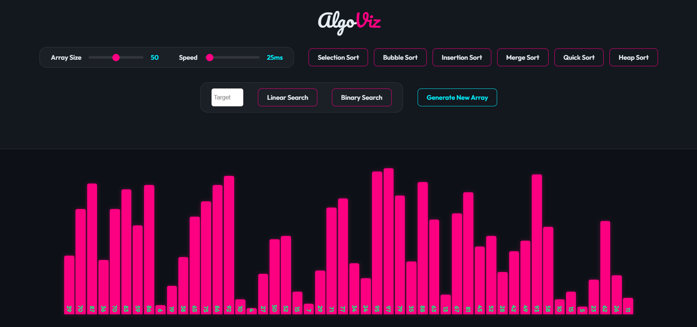

# AlgoViz - Algorithm Visualizer

**AlgoViz** is a modern, interactive web-based visualizer for Sorting and Searching algorithms. Built with a stunning dark-themed UI, glassmorphism effects, and dynamic sound feedback, it offers an immersive way to understand algorithmic concepts.

## ✨ Features

-   **Interactive Visualization**: Watch algorithms execute step-by-step in real-time.
-   **Modern Design**: Premium dark theme with neon accents (`#fd0081`, `#00f2ff`) and glassmorphism.
-   **Data Visibility**: Each bar displays its exact numeric value for clear tracking.
-   **Search Status**: Dedicated status display shows real-time search progress and results.
-   **Audible Feedback**: Dynamic sound effects based on value height during operations.
-   **Customizable**: Adjust array size and animation speed instantly.

## 📸 Screenshots

## 🚀 Algorithms Implemented

### Sorting Algorithms
1.  **Selection Sort**: Repeatedly finds the minimum element and places it at the beginning.
2.  **Bubble Sort**: Swaps adjacent elements if they are in the wrong order.
3.  **Insertion Sort**: Builds the sorted array one item at a time.
4.  **Merge Sort**: A divide-and-conquer algorithm that recursively divides and merges.
5.  **Quick Sort**: Partitions the array around a pivot element.
6.  **Heap Sort**: Utilizes a binary heap data structure for efficient sorting.

### Search Algorithms
1.  **Linear Search**: Iterates through the array sequentially to find the target.
2.  **Binary Search**: Efficiently finds a target in a **sorted** array by repeatedly dividing the search interval in half.

## 🛠️ How to Use

1.  **Open the App**: Launch `index.html` in your web browser.
2.  **Generate Array**: Click "Generate New Array" to create a fresh set of random numbers.
3.  **Sort**: Click any of the Sorting buttons to watch the array get sorted.
4.  **Search**:
    - Enter a number in the "Target" input box.
    - Click **Linear Search** to find it in the current array.
    - Click **Binary Search** (Note: For best results, sort the array first!).
    - Watch the **Status Text** below the controls for updates (e.g., "Found 42 at Index 7!").

## 💻 Tech Stack

-   **HTML5**
-   **CSS3** (Flexbox, Variables, Animations)
-   **JavaScript (ES6+)** (Async/Await for animations)

## 🤝 Contributing

Contributions are welcome! Feel free to fork the repository and submit pull requests for new algorithms (e.g., BFS/DFS, Pathfinding) or features.

---
*Created with ❤️ for learning algorithms.*
